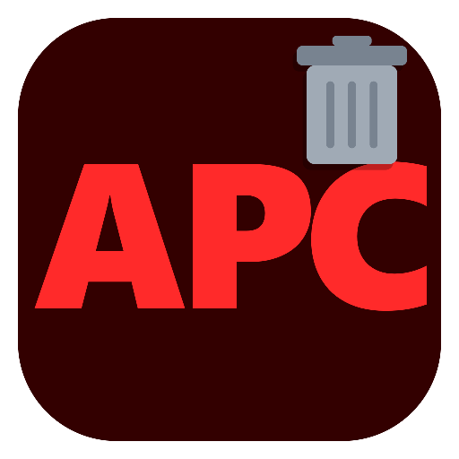

# Adobe Process Cleaner (APC)

🇪🇸 [Español](https://github.com/Cuby3212/AdobeProcessCleaner#-espa%C3%B1ol) | 🇬🇧 [English](https://github.com/Cuby3212/AdobeProcessCleaner#-english)

---

## 🇪🇸 Español

Una utilidad ligera diseñada para cerrar procesos persistentes de Adobe en segundo plano y liberar recursos del sistema en Windows.

### **Descripción general**

Las aplicaciones de Adobe Creative Cloud suelen dejar numerosos procesos en segundo plano, servicios y asistentes de sincronización en ejecución incluso después de cerrar el software principal. Adobe Process Cleaner (APC) automatiza la identificación y el cierre de estas tareas en segundo plano, asegurando que tu CPU y memoria no se vean sobrecargadas de procesos basura cuando no estés usando la suite Adobe.

### **Características principales**

* **Cierre completo de procesos:** Identifica y detiene todos los procesos activos relacionados con Adobe, incluidos los servicios de actualización y las tareas en segundo plano de sincronización en la nube.
* **Cero configuración:** Se ejecuta inmediatamente sin pasos de configuración complejos ni dependencias externas.

### **Cómo usarlo**

1. Descarga el ejecutable más reciente desde la sección de [Releases](https://github.com/Cuby3212/AdobeProcessCleaner/releases/latest) a la derecha.
2. Cierra todas las aplicaciones abiertas de Adobe Creative Cloud (por ejemplo, Photoshop, Premiere Pro, Illustrator).
3. Ejecuta `AdobeProcessCleaner.exe`.
4. Espera a que el proceso termine, y sigue las indicaciones de la terminal para completar la limpieza.

### **Aviso de Windows SmartScreen**

Es posible que Windows Defender SmartScreen muestre una advertencia al ejecutar la aplicación. Sin embargo, en caso de que aparezca un aviso de `Editor Desconocido`, la ejecución es completamente segura.

Esta herramienta carece de una costosa firma digital comercial, pero todo el proyecto es transparente: puedes revisar el código fuente directamente en este repositorio para comprobar por ti mismo que el programa es 100% seguro antes de usarlo.

Para proceder en caso de advertencia:

1. Haz clic en **Más información** en el aviso de SmartScreen.
2. Selecciona **Ejecutar de todas formas**.

### **Autor**

Creado y mantenido por Cuby3212.

### **Licencia**

Este proyecto está bajo la Licencia MIT. Consulta el archivo [LICENSE.md](LICENSE.md) para más detalles.

---

## 🇬🇧 English

A lightweight utility designed to close persistent background Adobe processes and free up system resources on Windows.

### **Overview**

Adobe Creative Cloud applications often leave numerous background processes, services, and sync assistants running even after closing the main software. Adobe Process Cleaner (APC) automates identifying and shutting down these background tasks, ensuring your CPU and memory aren't bogged down with unnecessary clutter when you aren't actively using the Adobe suite.

### **Key Features**

* **Complete process termination:** Identifies and stops all active Adobe-related processes, including update services and cloud sync background tasks.
* **Zero configuration:** Runs immediately with no complex setup steps or external dependencies.

### **How to Use**

1. Download the latest executable from the [Releases](https://github.com/Cuby3212/AdobeProcessCleaner/releases/latest) section on the right.
2. Close any open Adobe Creative Cloud apps (e.g., Photoshop, Premiere Pro, Illustrator).
3. Run `AdobeProcessCleaner.exe`.
4. Wait for the process to finish, and follow the terminal prompts to complete the cleanup.

### **Windows SmartScreen Notice**

Windows Defender SmartScreen might display a warning when launching the application. However, if an `Unknown Publisher` notice pops up, running the tool is completely safe.

This tool lacks an expensive commercial digital signature, but the entire project is transparent: you can inspect the source code directly in this repository to verify the program's safety before running it.

To proceed if the warning appears:

1. Click on **More info** in the SmartScreen prompt.
2. Select **Run anyway**.

### **Author**

Created and maintained by Cuby3212.

### **License**

This project is licensed under the MIT License. Check the [LICENSE.md](LICENSE.md) file for more details.
